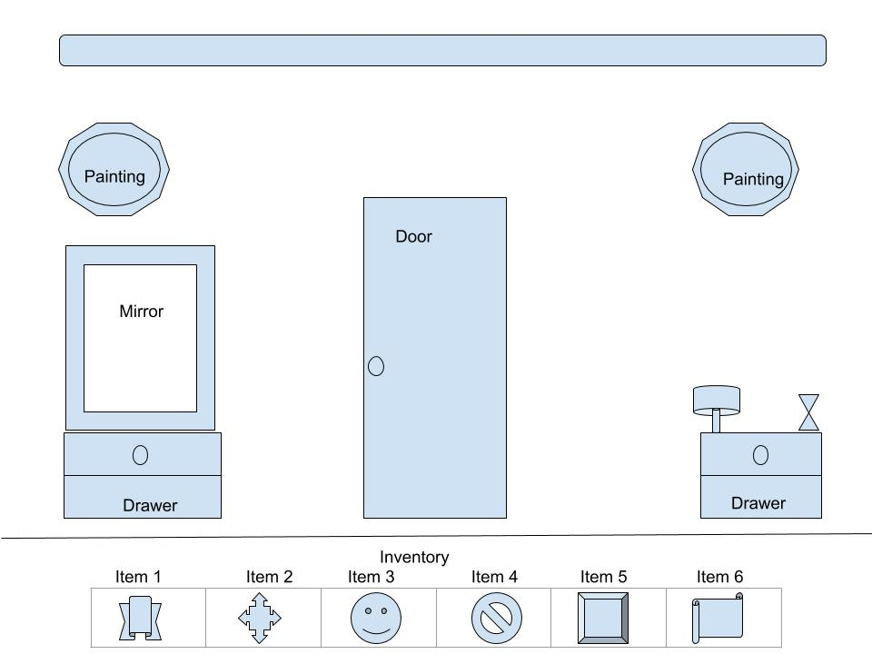
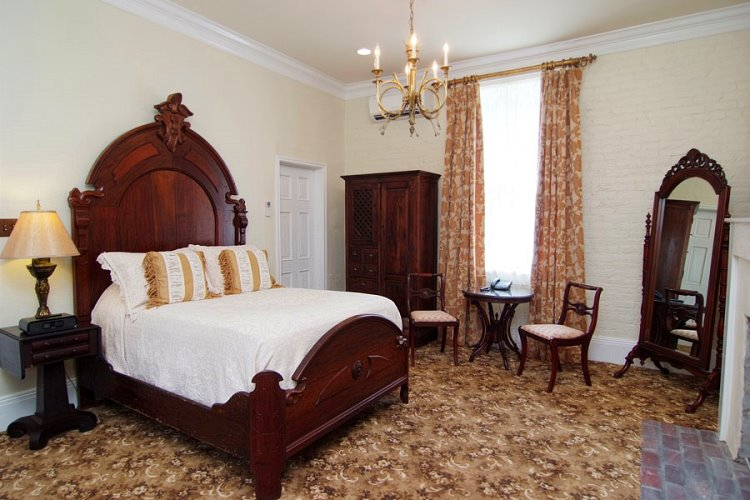

# Escape-Room

## Project Description
This is a game where the player tries to escape from a Mansion by looking for clues, solving puzzles, playing minigames and navigating through different rooms in the mansion so that he can find a way out.

## Wireframes
### Sample Room 1

### Sample Mansion Interior 1

## MVP
- Getting the images for the app
- Using phaser for the game development
- Making the player to be able to interact with the objects on screen
- Creating an inventory menu so that the user can take items from the rooms and add those items to his inventory
- Making the player to use items from his inventory on objects in the room
- Making the player to be able to navigate to different rooms in the mansion
- Create minigames like lockpicking, e.t.c
- Create game logic: like what the player has to do to navigate through the rooms, solve puzzles and find clues

## POST MVP
- Create a login page for players (Auth)
- Adding sounds and animations
- Drag and Drop (moving objects on the screen)

## Additional Libraries
- Node, Express or Rails
- Phaser
